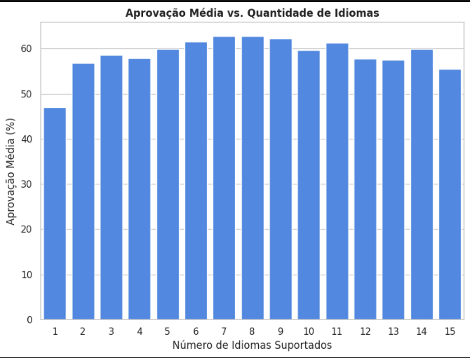
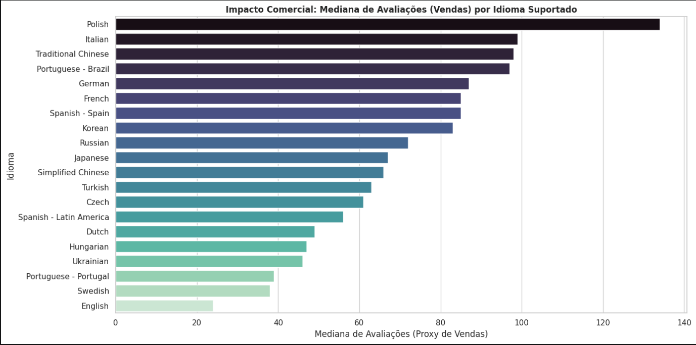
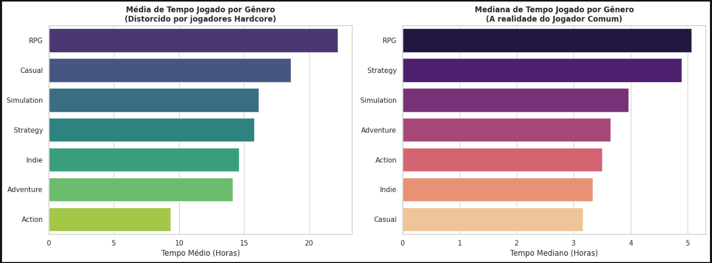
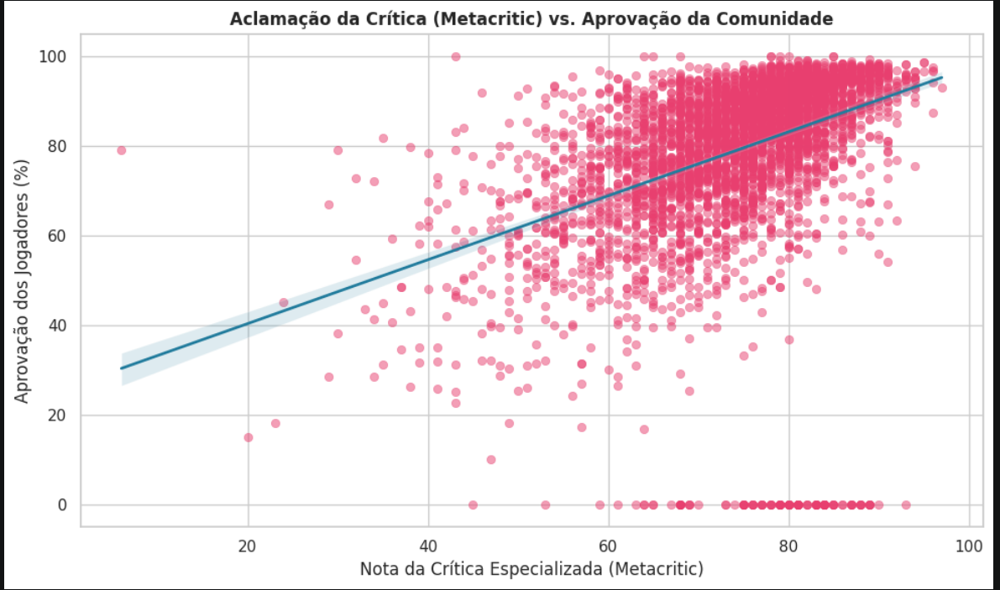
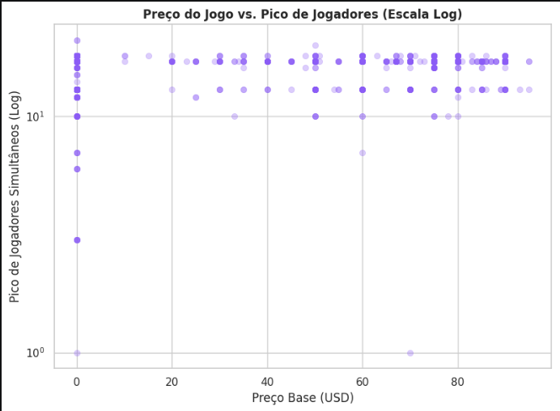
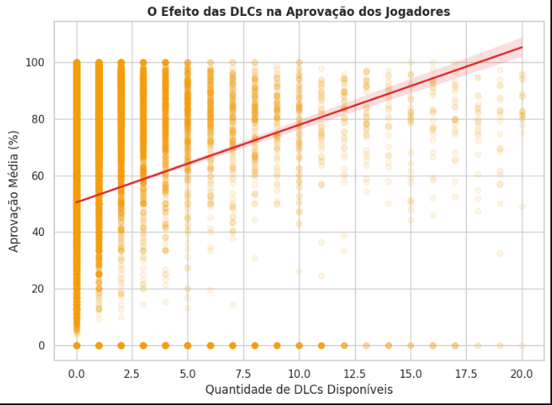
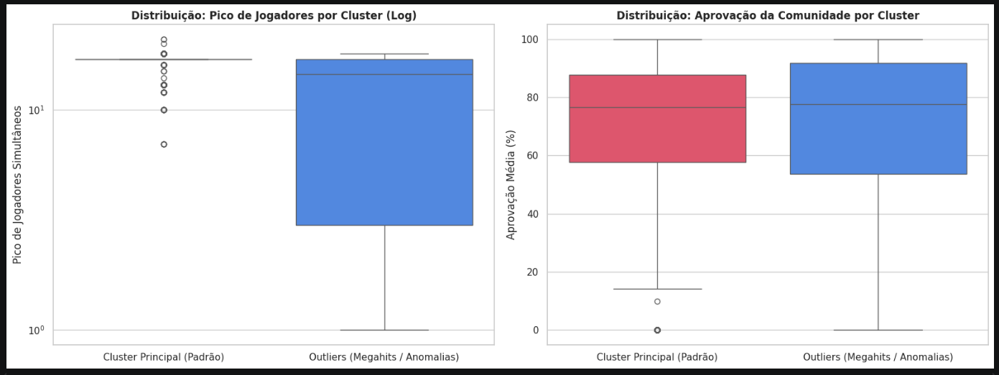

# Steam Data Insights: Uma Análise Orientada a Dados do Mercado de Games

---

## 1. Descrição

Este projeto investiga os fatores que impulsionam o sucesso, a retenção e a monetização no ecossistema da Steam. Guiado pela metodologia **CRISP-DM** e utilizando um conjunto de dados com mais de **120.000 títulos**, aplicam-se técnicas de Ciência de Dados e Aprendizado de Máquina para desmistificar suposições comuns do mercado por meio de evidências empíricas.

---

## 2. Tecnologias e Ferramentas

- **Linguagem:** Python
- **Manipulação de Dados:** Pandas
- **Visualização:** Matplotlib, Seaborn
- **Aprendizado de Máquina:** Scikit-Learn (DBSCAN, Regressão Linear)
- **Ambiente:** Jupyter Notebook
- **Controle de versão:** Git e GitHub
- **Fonte de dados:** [Steam Games Dataset — Kaggle](https://www.kaggle.com/datasets/fronkongames/steam-games-dataset)
- **Metodologia:** CRISP-DM

---

## 3. Problema e Objetivo

O mercado de jogos digitais opera sob diversas suposições não verificadas: mais idiomas significam mais aprovação? DLCs geram insatisfação? Crítica especializada e voz da comunidade convergem? Preço elevado afasta jogadores?

Este projeto responde cada uma dessas perguntas com dados reais, construindo um pipeline de análise exploratória e aprendizado de máquina que transforma 120.000 registros brutos em insights acionáveis para desenvolvedores e produtores do setor.

---

## 4. Pipeline da Solução

1. **Entendimento do Negócio**: formulação de hipóteses comerciais sobre elasticidade de preço, localização, DLCs e retenção de jogadores
2. **ETL e Preparação dos Dados**: limpeza de valores nulos, conversão de tipos e engenharia de atributos sobre 120.000+ registros
3. **Análise Exploratória (EDA)**: investigação de seis hipóteses de negócio com visualizações analíticas
4. **Modelagem**: regressão linear (Metacritic vs. comunidade) e clustering não supervisionado com DBSCAN
5. **Avaliação**: validação dos clusters por boxplots e interpretação dos outliers de mercado

---

## 5. Principais Descobertas

### 5.1 Localização: o ponto ideal está entre 7 e 9 idiomas



Suportar entre 7 e 9 idiomas corresponde ao pacote de localização global básico e maximiza a aprovação média dos jogadores. Acima disso, a satisfação cai, possivelmente por perda de qualidade nas traduções menos prioritárias.

---

### 5.2 Idioma como indicador de qualidade comercial



O Inglês apresenta a menor mediana de avaliações da plataforma por ser o padrão de projetos de baixo orçamento. Polonês, Italiano, Chinês Tradicional e Português (Brasil) lideram o ranking, não por tamanho de mercado, mas porque apenas estúdios com orçamento estruturado investem nessas localizações, o que se correlaciona a volumes de vendas significativamente maiores.

---

### 5.3 A ilusão da média: Casual cai do pódio quando usamos mediana



Pela média, jogos Casuais aparecem como o segundo gênero mais jogado. Pela mediana, que representa o comportamento do jogador comum, eles caem para o último lugar. O fenômeno é explicado por títulos "idle" e contas mantidas ativas para comércio de cartas colecionáveis, que inflam artificialmente a média. RPG e Estratégia lideram o engajamento real.

---

### 5.4 Crítica especializada vs. voz da comunidade



A regressão linear confirma convergência geral entre crítica e comunidade. Mas os outliers são os casos mais relevantes: **Cult Classics** acumulam 90%+ de aprovação popular com notas medianas de crítica, enquanto casos de **Review Bombing** mostram títulos aclamados destruídos pela comunidade por problemas técnicos ou monetização predatória pós-lançamento.

---

### 5.5 Preço elevado não afasta jogadores comprometidos



Títulos gratuitos concentram picos de acesso em massa, mas jogos entre 60 e 80 USD mantêm volumes elevados de jogadores simultâneos de forma consistente. A barreira de preço não inibe o engajamento quando o produto entrega valor proporcional ao investimento, padrão característico de títulos AAA.

---

### 5.6 O paradoxo das DLCs: mais conteúdo, mais aprovação



Contrariando a hipótese de que DLCs geram insatisfação por custos extras, os dados mostram crescimento de aprovação proporcional ao volume de expansões disponíveis. O fenômeno é explicado pelo **Viés de Sobrevivência**: estúdios investem em DLCs apenas em propriedades intelectuais com comunidade ativa e aceitação consolidada, selecionando naturalmente os títulos mais bem avaliados.

---

### 5.7 Clustering com DBSCAN: mapeando a dinâmica de mercado



O algoritmo DBSCAN segmentou o catálogo em dois grupos distintos:

| Cluster | Descrição | Característica |
|---------|-----------|----------------|
| **Cluster Principal (Padrão)** | Maioria do catálogo | Opera em margens estreitas de engajamento e pico de jogadores |
| **Outliers (Megahits / Anomalias)** | Grupo seleto de títulos | Rompe o padrão estatístico com picos de jogadores e aprovação acima da curva |

A validação por boxplots confirmou que a maior parte da plataforma opera em margens muito estreitas, enquanto um grupo seleto quebra completamente o padrão, evidenciando a estrutura de mercado winner-takes-all característica da indústria de games.

---

## 6. Como Reproduzir

**Pré-requisitos:** Python 3.8+, pip

```bash
# 1. Clone o repositório
git clone https://github.com/CaioRCosta/Steam-Data.git
cd Steam-Data

# 2. Instale as dependências
pip install pandas scikit-learn matplotlib seaborn notebook

# 3. Baixe o dataset
# Acesse: https://www.kaggle.com/datasets/fronkongames/steam-games-dataset
# Baixe o arquivo steam_games.csv e salve na raiz do projeto

# 4. Execute o notebook
# Abra steam.ipynb e rode todas as células em ordem
```

> **Nota:** O dataset não está incluído no repositório por restrições de tamanho do GitHub. O download direto pelo link do Kaggle é necessário antes de executar o notebook.

---

## 7. Contato

**LinkedIn:** [linkedin.com/in/caio-r-costa](https://www.linkedin.com/in/caio-r-costa/)

**GitHub:** [github.com/CaioRCosta](https://github.com/CaioRCosta)

**E-mail:** caiorcwork@gmail.com
